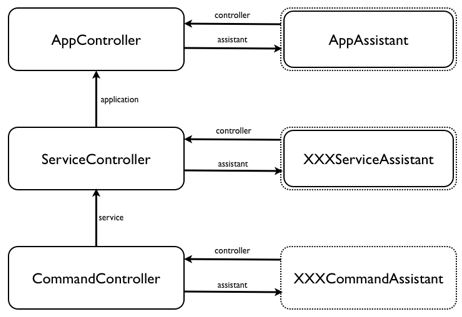

# Structure of a Mojo Service

The basic structure of a Mojo Service is shown above.  The controllers (on the left) are provided by the Mojo Service framework, while the assistants (on the right) are provided by the service  (in fact, the AppAssistant and XXXServiceAssistants are optional - the framework will provide a default implementation if the service does not).  In a typical service, there will be a single AppController/Assistant pair and a single ServiceController/XXXServiceAssistant pair (assuming the application only supports a single service).  A pair of CommandController/XXXCommandAssistants are created for each incoming command and persist until the command has terminated.

### AppController and AppAssistant

There is one **AppController/AppAssistant** pair per application.  Applications rarely need to refer to the this pair.

#### AppController

The **AppController** defines a number of properties:

* **assistant**

	Is a reference to the AppAssistant associated with this controller.  There is one of these per application.  If the programmer does not provide one, the framework will create a default.

* **config**

	Is a reference to the configuration object for this application.

* **serviceFactory**

	This factory has a method **createServiceAssistant(serviceConfig)** and is used to create service assistants.  It is not used directly by applications.
	
#### AppAssistant

The default AppAssistant has no functionality.  It may be overridden by the developer, who may implement any of the following optional properties:

* **activityTimeout**

	This override the activity timeout for this application.  This is the time the application should run without any activity before it is shutdown.  The timeout is in seconds.

* **commandTimeout**

	This overrides the command timeout for this application.  This is the time a command can execute before an error is returned to the caller.  The timeout is in seconds.

* **controller**

	Is a reference to the **AppController**.

* **createServiceAssistant(serviceConfig)**

	This overrides the default **AppController** service factory.

* **getConfiguration()**

	This function returns an object which provides the configuration of the entire application.  The format of this object should follow that used in **services.json** which this overrides.
	
* **setup()**

	This method is called when the application is being initialized.  It is called before any services are initialized.

* **cleanup()**

	This method is called when the application is being shutdown.  It is called after all the services have been shutdown.

### ServiceController and XXXServiceAssistant

There is one **ServiceController/XXXServiceAssistant** per service.  An application may define a specific XXXServiceAssistant (replacing the **XXX** with a more appropriate string and adding the assistant name to the **services.json** file) although this is usually unnecessary.  All command executing in a service will have a reference to the same **ServiceController**.

#### ServiceController

The **ServiceController** defines a number of properties:

* **application**

	Is a reference to the AppController for this service.

* **assistant**

	Is a reference to the XXXServiceAssistant for this controller.  There is one per service type.  If the programmer does not provide one, the framework will create a default.

* **config**

	Is a reference to the configuration object for this service.

* **commandFactory**

	This factory has a method **createCommandAssistant(commandConfig)** and is used to create command assistants.  It is not used directly by applications.
	
* **commandRunner**

	This has a method **runCommand(commandController)** which is used to execute a give command.  It is not used directly by applications.

* **name**

	Is the name of this service on the Palm Bus.
	
#### XXXServiceAssistant

The default XXXServiceAssistant has no functionality.  It may be overridden by the developer, in which case its name should be specified in the **services.json** file.  An implementation may implement any of the following optional properties:

* **controller**

	Is a reference to the **ServiceController**.

* **createCommandAssistant(commandConfig)**

	This overrides the default **ServiceController** commandFactory.

* **getConfiguration()**

	This function returns an object which provides the configuration of this service.  The format of this object should follow that used in **services.json** which this overrides.

* **runCommand(commandController)**

	This overrides the default **ServiceController** commandRunner.

* **setup()**

	This method is called when the service is initialized.  It is called after the application is initialized.  If the service cannot complete initialization immediately, it should return a **future**.  Until this future has a result, commands will not be dispatched to the service.
	
* **cleanup()**

	This method is called when the service is being shutdown.  It is called before the application is shutdown.

* **timeout**

	This overrides the default command timeout for this service.  This is the time a command can execute before an error is returned to the caller.

### CommandController and XXXCommandAssistant

The **CommandController/XXXCommandAssistant** pair are used to execute an incoming command.  The CommandController provides the common functionality for commands, while the XXXCommandAssistant implements the service specific action.

#### CommandController

The command controller provides a number of properties for the assistant:

* **activity**

	Every command is associated with an **activity** (see [Activities](activity)).  Activities are use to control how the service is scheduled and what resources it can use. The service is guaranteed to keep running while it has active activities, but may be shutdown othewise (to save memory).  Generally, the Mojo Services framework will manage activities on the commands behalf.
	
* **args**

	Is an object representing the JSON payload send to this command.

* **assistant**

	Is a reference to the XXXCommandAssistant associated with the execution of this command.

* **config**

	Is a reference to the configuration object for this command.
	
* **future**

	The **future** property (see [Futures](futures)) is used to send the asynchronous reply to this command.  A reply is sent my assigning to *future.result*.

* **message**

	Is a reference to the raw message received from the underlying Javascript engine.
	
* **service**

	Is a reference to the **ServiceController** for this command.

* **watch**

	The **watch** property is a *Future* (see [Futures](futures)).  If a command is watchable, a watch reply can be sent by assigning to *watch.result*.  Watches should only be sent after the initial reply (via the **future** property) has been sent.
	
#### XXXCommandAssistant

A ***XXXCommandAssistant*** must be implemented for each command of the service.  An implementation may implement the following properties:

* **controller**

	This is a reference to the **CommandController**.

* **run(future, watch|subscription)**

	This method **must** be implemented.  The actual work of the command starts here.  The reply is sent by assigning to *future.result*.  This can be done asynchronously; returning from this method does not mean the command has been completed.  If this command is watchable, a future reply can be sent by assigning to the *watch.result* property.  If the command is subscribeable, a subscription factory is passed to the run method.  A **get()** method on this factory is used to provide a potential infinite set of futures which can be used to return additional results to the caller.

* **setup()**

	This method is called when the command is initialized.  It is called before the command is run.

* **cleanup()**

	This method is called when the command has sent its last reply to the caller.
	
* **timeout**

	This overrides the timeout for this command.  This is the time this command can execute before an error is returned to the caller.
